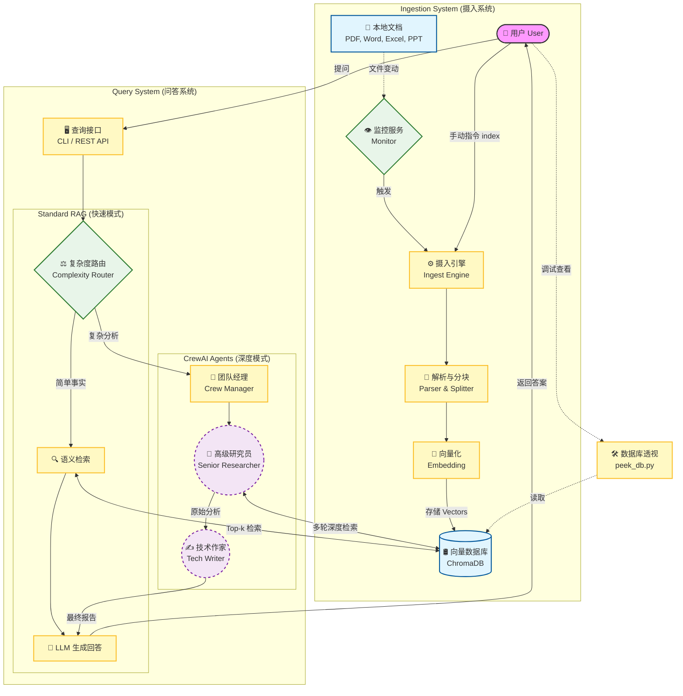

# docBrain

## 简介
**docBrain** 是一个深度集成的本地知识索引与智能问答系统。它不仅能静默索引您的本地文档（PDF, Word, Excel, PPTX等），还能通过浏览器插件连接 API 进行实时配置与内容抓取。

最核心的进化是：**docBrain 现在集成了 CrewAI 多智能体框架**。它能自动评估问题的复杂度，对于简单事实直接回答，而对于跨文档的复杂分析（如：根据战略规划分析财务表现），则会自动派出由"高级研究员"和"技术作家"组成的智能体团队进行深度研判。

## 核心功能
*   **🧩 CrewAI 多智能体协同**：集成高级研究员与技术作家。自动拆解复杂问题，执行多步搜索与深度综合。
*   **🔌 浏览器插件/API 支持**：对外暴露 REST API，支持浏览器插件进行连接、实时摄取网页内容及系统配置。
*   **⚖️ 复杂度自动路由**：系统会自动判断问题难度。简单问题走标准 RAG（快速），复杂问题启动 CrewAI（深度）。
*   **📄 全格式文档支持**：支持 TXT, MD, PDF, Word (.docx/doc), Excel (.xlsx/xls), PPT (.pptx/ppt)。
*   **⏱️ 精准溯源与精力追踪**：自动记录路径并累计计算您在每个知识点上投入的**编辑/浏览时间 (Effort Time)**。
*   **🚀 高质量检索 (Quality Mode)**：支持路径关键词加权，优先从核心项目目录提取信息。
*   **🔍 数据库透视**：内置 `peek_db.py` 工具，可直接查看向量库中的原始分块。

---

## 业务流程

以下流程图描述了 docBrain 的两个核心工作流：
1. **文档摄入与索引 (Ingestion Flow)**：如何将本地文件转化为向量知识。
2. **智能问答路由 (Query & Routing Flow)**：如何处理用户提问，并在标准 RAG 与 CrewAI 智能体之间进行路由。



### 架构组成
1.  **智能摄入引擎**：基于 `watchdog` 的实时监听，自动处理多种办公格式文档。
2.  **REST API 接口层**：基于 `FastAPI` 提供配置管理、网页摄取及远程问答功能。
3.  **多智能体核心 (CrewAI)**：由高级研究员智能体进行分级搜索，技术作家智能体进行逻辑汇总。
4.  **向量存储层 (ChromaDB)**：高性能本地向量数据库，确保持久化存储。
5.  **前端展示层 (React + Vite)**：基于 React 19 + Vite 7 构建，使用 [@vitejs/plugin-react](https://github.com/vitejs/vite-plugin-react/blob/main/packages/plugin-react) 实现 Fast Refresh。生产环境建议启用 [React Compiler](https://react.dev/learn/react-compiler/installation) 以优化性能，并集成 [typescript-eslint](https://typescript-eslint.io) 增强代码质量。

---

## 愿景与价值

`docBrain` 不仅仅是一个本地搜索工具，它代表了 **"数字孪生大脑" (Digital Twin Brain)** 的一种实现方案：让 AI 深度理解您的数字生活，而无需您付出任何额外的维护成本。

### 核心应用场景

#### 1. 深度工作者的"离线大脑"
*   **场景**: 您有分布在不同年份、不同格式（PDF, Word, PPT）的数千个项目文件。
*   **应用**: 询问"去年关于 X 客户的合作亮点有哪些？"，系统跨格式调取片段并自动归纳，避免了翻箱倒柜找文档。

#### 2. 跨模态知识缝合（实时追踪）
*   **场景**: 您一边查阅本地技术文档，一边在浏览器搜索最新的 API 更新。
*   **应用**: 利用浏览器插件同步功能，您可以问："结合我本地配置的数据库脚本和刚刚查到的最新优化建议，写一份调优方案。"

#### 3. 高效率工作复盘（周报/月报神器）
*   **场景**: 周五下午需要写出一周的进度，但细节已经模糊。
*   **应用**: 运行指令获取本周新增知识片段，启用 `--quality` 模式后，AI 会优先从您的工作路径提取事实，自动生成高质量的工作总结。

#### 4. 存而不用者的"知识激活"
*   **场景**: "存了等于学了"的焦虑，收藏夹和磁盘深处积压了大量资料。
*   **应用**: docBrain 通过静默扫描，让这些沉睡的数据重新进入 AI 的语义检索范围，在您提问时随时被唤醒。

### 进阶：从"个人效能"到"组织资产"

*   **自动化的"专家地图"**：基于 `Effort Time` 的统计，快速定位真正的组内专家。
*   **知识"不辞职"**：员工离职不代表知识流失，离线方案和调研草稿都能被留存在团队的"数字资产库"中。

### 核心价值

| 价值 | 说明 |
|:---|:---|
| **无感 (Zero Friction)** | 您不改变任何习惯，它就能在后台完成一切 |
| **本地优先的隐私屏障** | 向量特征保留在本地，只有脱敏后的上下文才与 LLM 通信 |
| **从"索引"到"综合"** | 不是"搜到文件"，而是"给出答案"，缩短信息到洞见的距离 |
| **团队传承的透明资产** | API 模式为团队共享提供可能，降低沟通成本 |

---

## 快速开始

### 1. 快速部署 (推荐)
直接运行一键配置脚本，它会自动为您创建虚拟环境、安装依赖并引导配置 API Key。

*   **Windows**: 双击运行 **`setup.bat`**
*   **macOS / Linux**: 在终端运行 **`./setup.sh`**

### 2. 配置
运行 setup 脚本后，生成的 `.env` 文件包含：
*   `DEEPSEEK_API_KEY`: 您的 LLM API Key (推荐 DeepSeek-V3)。
*   `WATCH_DIR`: 默认监控路径。
*   `API_KEY`: API 访问令牌（默认：`docbrain_default_key`）。

### 3. 运行 API 服务 (集成插件)
启动 API 服务器以连接浏览器插件或第三方工具：
```bash
# macOS / Linux
bash run_api.sh

# Windows
run_api.bat
```
API 默认端口为 `8000`。

---

## 命令指南 (CLI)

| 场景 | 命令 | 说明 |
| :--- | :--- | :--- |
| **智能问答 (自动路由)** | `python src/main.py ask "您的提问"` | 基本用法，自动选择单/多智能体模式 |
| **强制智能体模式** | `python src/main.py ask "..." --crew` | 强制启动 CrewAI 团队 |
| **单智能体模式** | `python src/main.py ask "..." --no-crew` | 强制跳过 Agent 流程 |
| **高质量总结** | `python src/main.py ask "..." --quality` | 启用提权算法进行核心总结 |
| **启动监控服务** | `python src/main.py watch [dir]` | 实时监听文件变动并同步索引 |
| **查看知识分布** | `python src/main.py list` | 列出所有已建索引的文件及 Effort 统计 |

## 开放接口 (API)

| 接口 | 方法 | 说明 |
| :--- | :--- | :--- |
| `/health` | `GET` | 健康检查 |
| `/config` | `GET/POST` | 获取或更新系统配置（持久化至 .env） |
| `/query` | `POST` | 远程提问接口 |
| `/documents` | `GET` | 以 JSON 格式获取已索引文档列表 |
| `/ingest/webpage`| `POST` | 摄取网页内容（支持 HTML/Markdown） |

*认证方式：所有受保护接口需在 Header 中携带 `Authorization: Bearer <API_KEY>`*

---
*docBrain - 让您的每一份文档和每一次阅读都有迹可循。让数据自然沉淀，让大脑专注创造。*