# docBrain 业务服务流程图

以下流程图描述了 docBrain 的两个核心工作流：
1. **文档摄入与索引 (Ingestion Flow)**：如何将本地文件转化为向量知识。
2. **智能问答路由 (Query & Routing Flow)**：如何处理用户提问，并在标准 RAG 与 CrewAI 智能体之间进行路由。

```mermaid
graph TD
    %% 定义样式
    classDef actor fill:#f9f,stroke:#333,stroke-width:2px;
    classDef storage fill:#e1f5fe,stroke:#01579b,stroke-width:2px;
    classDef process fill:#fff9c4,stroke:#fbc02d,stroke-width:2px;
    classDef decision fill:#e8f5e9,stroke:#2e7d32,stroke-width:2px,rhombus;
    classDef agent fill:#f3e5f5,stroke:#7b1fa2,stroke-width:2px,stroke-dasharray: 5 5;

    %% 角色与存储
    User([👤 用户 User]):::actor
    Docs[📄 本地文档<br/>PDF, Word, Excel, PPT]:::storage
    VectorDB[(🛢️ 向量数据库<br/>ChromaDB)]:::storage
    
    %% 监控与摄入模块
    subgraph "Ingestion System (摄入系统)"
        Watchdog{👁️ 监控服务<br/>Monitor}:::decision
        IngestEngine[⚙️ 摄入引擎<br/>Ingest Engine]:::process
        Parser[📝 解析与分块<br/>Parser & Splitter]:::process
        Embed[🔣 向量化<br/>Embedding]:::process
        
        Docs -.->|文件变动| Watchdog
        Watchdog -->|触发| IngestEngine
        User -->|手动指令 index| IngestEngine
        
        IngestEngine --> Parser
        Parser --> Embed
        Embed -->|存储 Vectors| VectorDB
    end

    %% 问答与路由模块
    subgraph "Query System (问答系统)"
        QueryInterface[🖥️ 查询接口<br/>CLI / REST API]:::process
        Router{⚖️ 复杂度路由<br/>Complexity Router}:::decision
        
        User -->|提问| QueryInterface
        QueryInterface --> Router
        
        %% 路径 A: 简单模式
        subgraph "Standard RAG (快速模式)"
            SimpleRAG[🔍 语义检索]:::process
            LLM_Gen[🤖 LLM 生成回答]:::process
            
            Router -->|简单事实| SimpleRAG
            SimpleRAG <-->|Top-k 检索| VectorDB
            SimpleRAG --> LLM_Gen
        end
        
        %% 路径 B: 智能体模式
        subgraph "CrewAI Agents (深度模式)"
            CrewManager[🎩 团队经理<br/>Crew Manager]:::process
            Researcher((🔎 高级研究员<br/>Senior Researcher)):::agent
            Writer((✍️ 技术作家<br/>Tech Writer)):::agent
            
            Router -->|复杂分析| CrewManager
            CrewManager --> Researcher
            Researcher <-->|多轮深度检索| VectorDB
            Researcher -->|原始分析| Writer
            Writer -->|最终报告| LLM_Gen
        end
        
        LLM_Gen -->|返回答案| User
    end

    %% 旁路逻辑
    Peek[🛠️ 数据库透视<br/>peek_db.py]:::process
    User -.->|调试查看| Peek
    Peek -.->|读取| VectorDB
```

